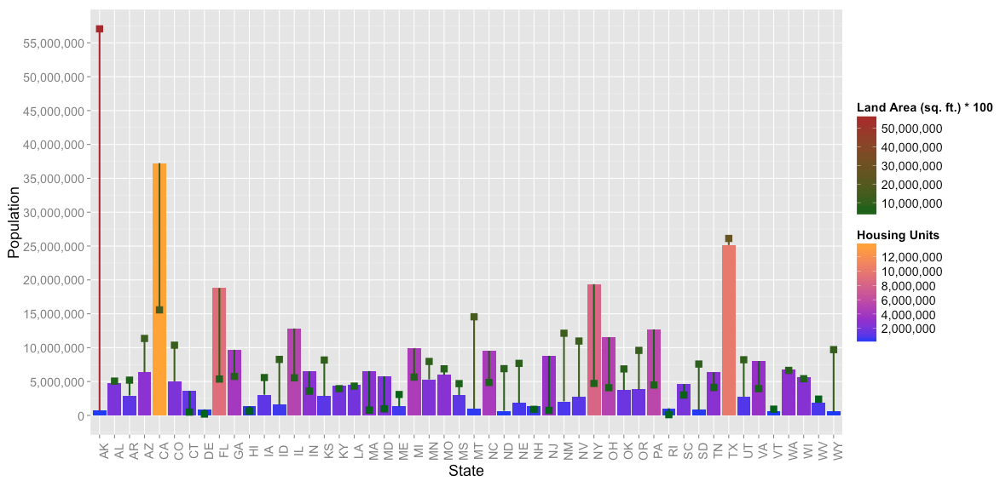

Created by: Natasha Halfin, Evan Johnston, and Kaylyn Zvonek 

```{r, echo=TRUE}
library("bitops")
library("datasets")
library("dplyr")
library("ggplot2")
library("ggthemes")
library("gplots")
library("graphics")
library("grDevices")
library("grid")
library("jsonlite")
library("knitr")
library("lubridate")
library("methods")
library("RCurl")
library("reshape2")
library("rmarkdown")
library("rstudio")
library("scales")
library("stats")
library("tidyr")
library("utils")

source("../01 Data/Data.R")
source("../02 Data Wrangling/DataWrangling.R")
source("../03 Visualizations/Visualizations.R")
```


For our project, we chose to work with three datasets. One contains data on the top 5000 companies in the U.S., the second contains state employment data, and the third data set describes housing data by state. Our goal was to cover as much material as possible covered in class, including data blending, data joins, beautiful plotting, data wrangling, SQL crosstabs, and advanced table calculations.

Below is a snapshot of the dataframes for each dataset prior to any data manipulation.

Top Companies Data

```{r, eval = TRUE, echo=TRUE}
data.frame(head(dfTOPCOMPANIES))
```

State Employment Data
```{r, eval = TRUE, echo=TRUE}
data.frame(head(dfSTATETOTALS))
```

State Housing Data
```{r, eval = TRUE, echo=TRUE}
data.frame(head(dfSTATEHOUSING))
```


## Data Wranglings

The dataframe below displays a left join between the state employment data and the state housing data based on the key of state. There have also been mutated columns added that represent calculated values based on existing columns, such as Average Employment (AVG_EMP).
```{r, eval=TRUE, echo=TRUE}
data.frame(head(dfSTATEHOUSINGTOTALS))
```
**************
This dataframe displays the Top Companies Data grouped by Industry and State, with summarized values indicating average revenue and growth.
```{r, eval=TRUE, echo=TRUE}
data.frame(head(dfTopCompanies2))
```
**************

This dataframe the same combination of Top Companies data as the one above,except it is filtered to only show results for Texas companies and industries.
```{r, eval=TRUE, echo=TRUE}
data.frame(head(dfTopCompanies3))
```
**************

This dataframe is a left join between a dataframe of the Top Companies data, grouped by state, with dfSTATEHOUSINGTOTALS from above. This displays a wide range of industry, employment, and housing data for each state.
```{r, eval=TRUE, echo=TRUE}
data.frame(head(dfTOTALS))

```

****************
The dataframe below utilizes SQL crosstabs by ranking companies within the Top Companies dataset, when partitioned by industry, and ordered by revenue.
```{r, eval=TRUE, echo=TRUE}
data.frame(head(dfRANKREVENUE))
```
*************

This dataframe is another ranking SQL crosstab, this time for the housing dataset. Here, we display the ranking of population density by state.
```{r, eval=TRUE, echo=TRUE}
data.frame(head(dfRANKPOPDENSITY))
```
************
## Visualizations in R

The wrangled dataframes from above and others allow for interesting visualizations from the data on companies, housing, and state demographics.

****************
This first visualization shows population by state, where population includes all persons in society. Additionally, it shows the number of housing units, colored by intensity, per state, and land area (*100 for scalar mapping appropriateness) as shown by the squares.
This graph demonstrates the non-linear relationship between population, housing, and geographical space.


****************

The second visualization attempts to show a relationship between Employment rate and Average Annual pay. Such a relationship should intuitively exist, and be positively correlated. The data do show a positively correlated regression, but much variance can be seen by the spread of the dots.
Additionally, this plot shows the number of establishments and population to give the viewer alternate considerations of possible confounding variables.


****************

This third visualization converts employment rate, average employment per state, average annual income, and average growth to normalized distributions so they can be simultaneously compared. It is clear that these metrics are mostly normal, all having a mean within 1 standard deviation of each other.
Additionally, it can be seen that the average annual pay (in nominal terms) is below the mean farther than other metrics (pay, employment, and growth) which is consistent with current literature suggesting that nominal wages have not caught up to economic growth. Similarly, this could be related to why we have seen increased employment in recent years, yet poverty rates are still higher than normal.


****************

## Tableau Visualizations
Employment rate is a calculated field that finds the average employment rate by state by dividing number of employed people by the population. Pay rate is a calculated field that displays the average annual pay by state. It is found by dividing the total payroll for an entire state by the state's number of employees. Size displays the pay rate and color displays the employment rate. The database used is a join of the state housing and state totals tables on state.   


***************
Color shows the state that performs best in a given industries. The text shows a given industries percentile contribution to a state with all the industries in one state adding up to 100%. The data used is from the top companies table.


******************
A dual axis is used to show population density on top of a double bar chart displaying land and water proportions by state. The database used is a join of the state housing and state totals tables on state.


 ***********************
The color shows the total area of a state and the size shows the population of a given state.


***************************
The nth parameter is used to show nth growth by city from unique company ids. The color range reflects the lowest to highest growth over all company ids. The top companies table is used.  


