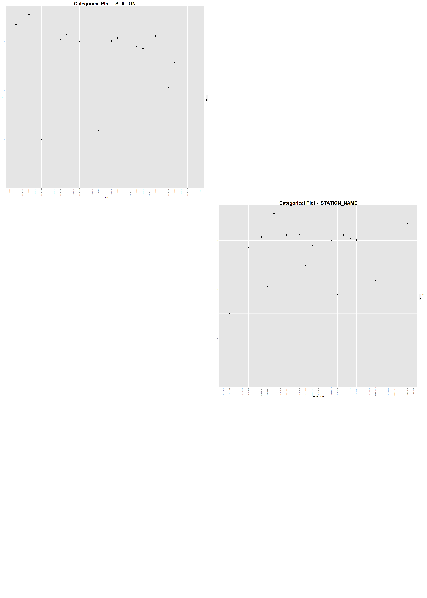
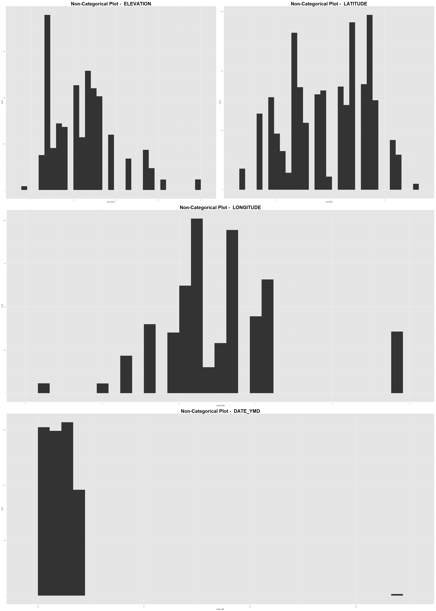

Natasha Halfin, Evan Johnston, Kaylyn Zvonek

For this project, we used a dataset containing information on the climates in major US cities including Nashville, Austin, and Seattle. 

```{r, echo=TRUE}
library("ggplot2")
library("gplots")
library("bitops")
library("knitr")
library("jsonlite")
library("ggthemes")
library("RCurl")
library("reshape2")
library("tidyr")
library("dplyr")
library("grid")
```

```{r, eval = TRUE, echo=TRUE}
source("../01 Data/climate_data.R")
source("../02 Data Wrangling/data_wranglings1.R")


```

These are our 3 climate tables from data on Austin, Nashville, and Seattle.

We chose these 3 cities because its interesting to know about local weather and at least one of us has lived in each city. Additionally, each city exhibits unique weather patterns, so we thought it would be insightful to compare each city across a few variables.

We added 2 columns to our data frames: Season and City. Season is based on the date column and City is based on the table name. 

The value -9999 represents a null value. 

```{r, eval =TRUE, echo=TRUE}
data.frame(head(austin_data))
data.frame(head(nash_data))
data.frame(head(seat_data))

```

Here is our data dictionary which explains our climate codes. 

PRCP= Precipitation   
SNOW = Snowfall   
SNWD = Snow depth   
TMAX = Maximum temperature   
TMIN = Minimum temperature   


We filtered by dates in each table to create the season variable values. Then we bound the new rows to the season column in each table.
 

This allowed us to create an inner join that finds the average precipitation by Season of each city. 
```{r, eval =TRUE, echo=TRUE}
data.frame(SEASON_InnerJoin)
```

This inner joined dataframe displays the max precipitation of each city by date with a join on date.
```{r, eval =TRUE, echo=TRUE}
data.frame(head(prcp_InnerJoin))
```

This left outer join finds the min and max recorded temperatures for Seattle and Nashville by date. 

```{r, eval =TRUE, echo=TRUE}
data.frame(head(nash_seatTEMP))
```

**Data Visualizations**

```{r, eval = TRUE, echo=TRUE}
source("../03 Visualizations/practice_viz.R")

```

**Max Precipitation by Date and City**
The third plot shows the max percipitation of a city grouped by the date. Therefore it reports whichever weather station in a specific city reported the most rain on a given day.
 
```{r, eval=TRUE, echo=TRUE}
plot(g1)
```

**Maximum and Minimum Temperature by Date and City**
This plot shows the distribution of maximum and minimum temperatures by city throughout the span of the year. There are clear trends for which city exhibits more extreme temperatures, but it is interesting to note that occasionally Nashville exhibits lower minimum temperatures than Seattle.

```{r, eval = TRUE, echo = TRUE}
plot(g2)
```

**Max Temp by Season**
This second plot shows the temperature range by Season of each city. The violin plot is an interesting way to show the variation in temperature per season. Interestingly Fall and Spring tend to have a much wider range of temperatures than Summer and Fall.

```{r, eval =TRUE, echo=TRUE}
plot(g4,vp=viewport(layout.pos.row=2,layout.pos.col=1))

```
**Max Temp per City**
The first plot shows the maxium temperature over time by city without null values.

```{r, eval =TRUE, echo=TRUE}
plot(g3,vp=viewport(layout.pos.row=1,layout.pos.col=1))

```

**Categorical Visualizations**
 
**Non-Categorical Visualizations**
 
