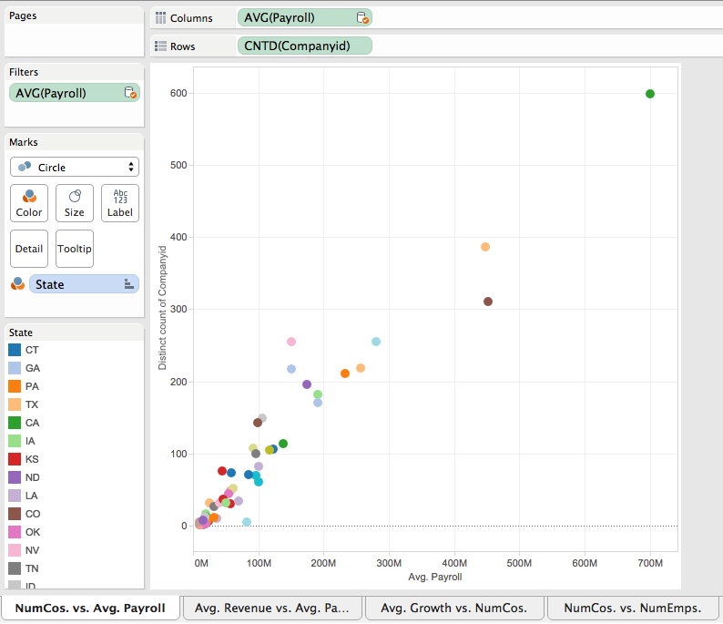
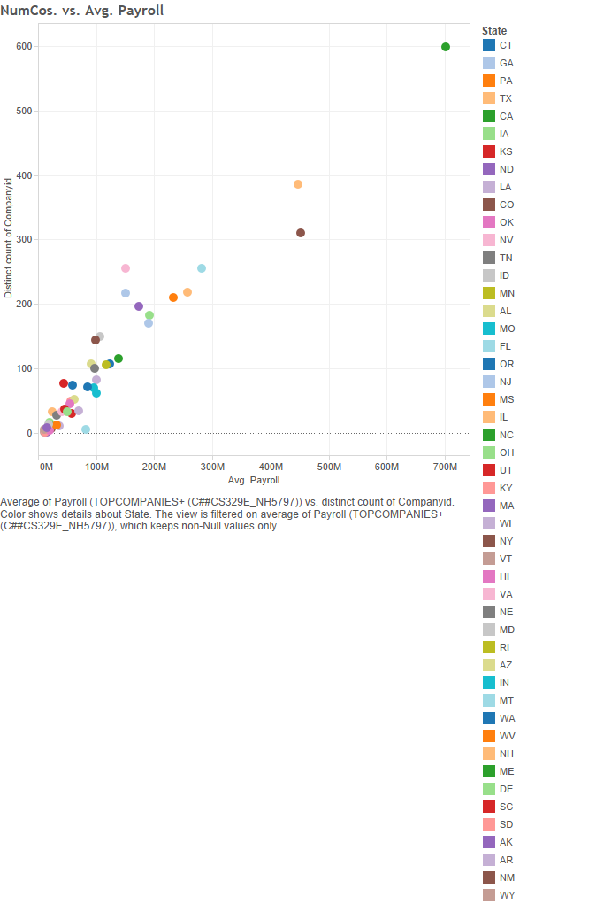
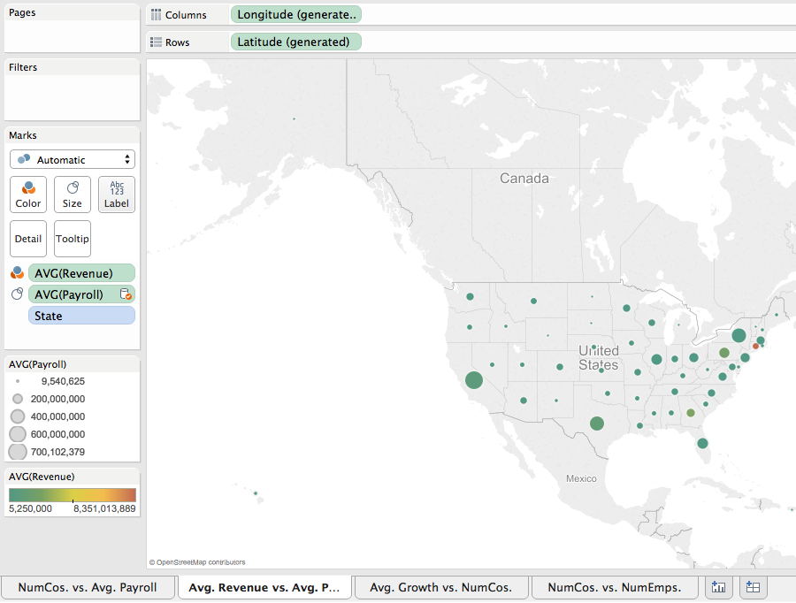
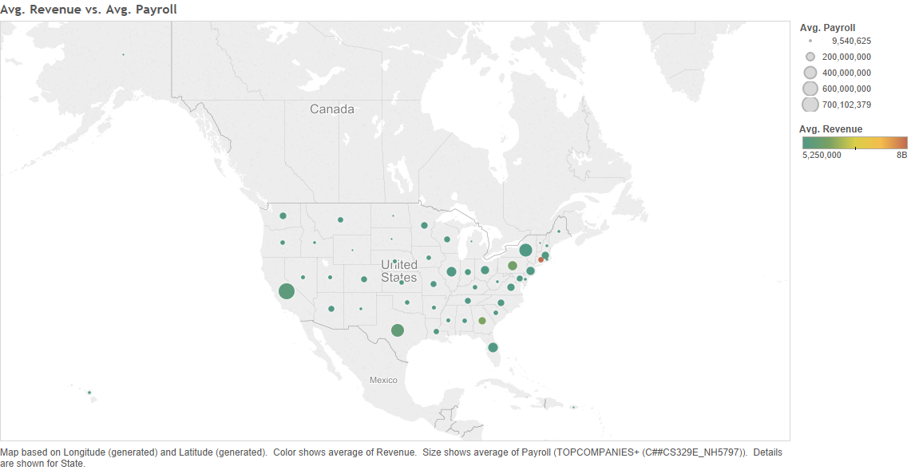
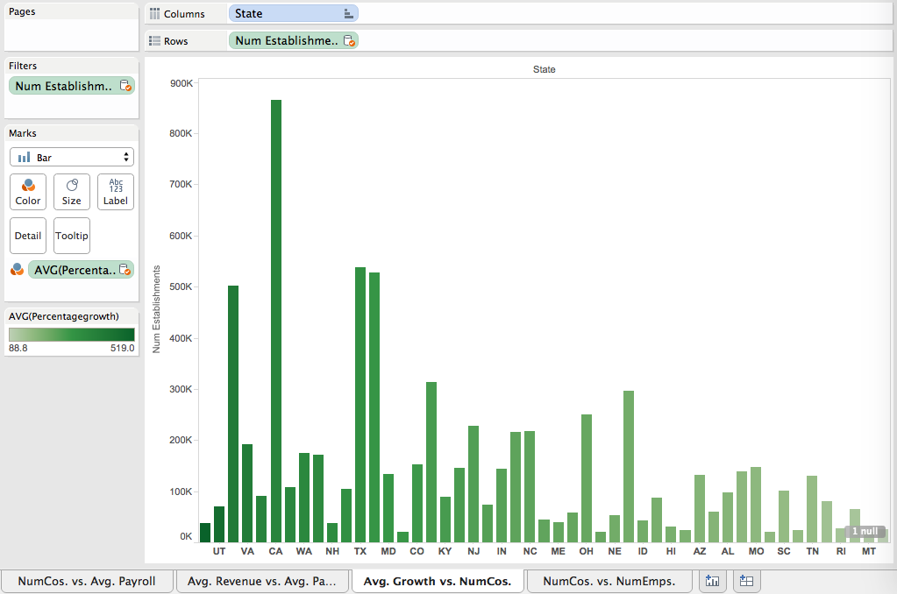
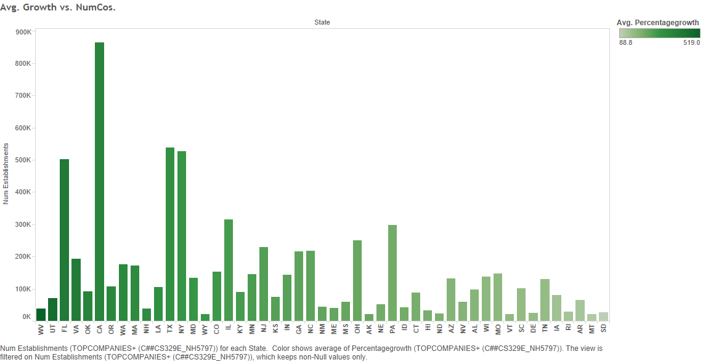
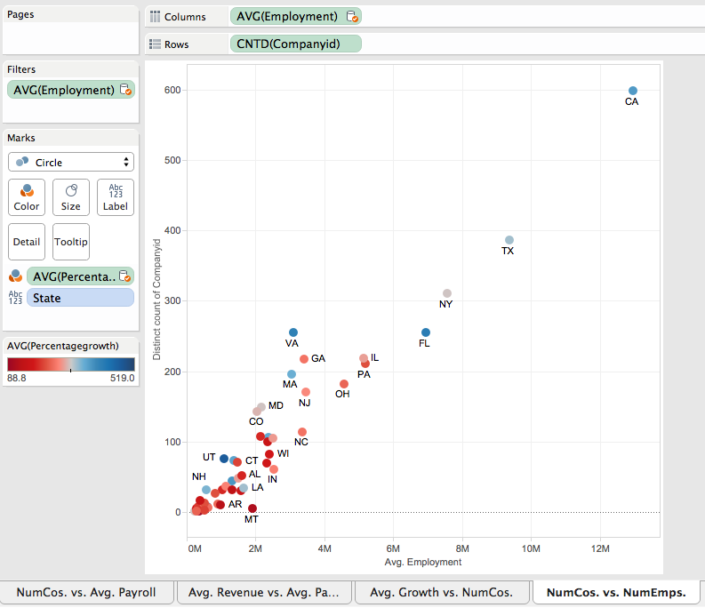
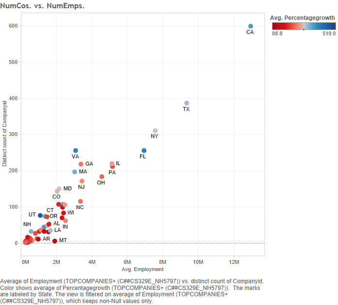

Created by: Natasha Halfin, Evan Johnston, and Kaylyn Zvonek 

For this project, we blended the TopCompanies dataset with the StateTotals dataset. TopCompanies displays data for the top 5000 companies in the country by state and industry, and includes revenue and growth. StateTotals includes employment and payroll data for each state.

While TopCompanies does not include every company in a state, it is interesting to view the statistics of states that are doing well within the top companies list. For instance, if there are more companies from a particular state on the top 5000 companies list, it would be interesting to look at how well people on average are paid within that state. 

From the TopCompanies data set we found the number of companies based on state and compared it to the StateTotal's average company payroll for that state. We can witness a linear relationship between the two factors.
 

***********************************************

From the TopCompanies data set we found the average Top 5000 company revenue based on state and compared it to the StateTotal set's average payroll based on state. We thought it would be interesting to see if the states with more top companies paid more. Connecticut by far has the highest revenue which could be attributed to companies like GE being based there. However, we found that states with more top performing companies do not necessarily pay more. 

 
 
************************************************

From the TopCompanies data set we found the average growth of each state and compared it to the StateTotals's number of establishments by state. We thought it would be interesting to see if the states with more growth had more establishments. However, this was not the case, revealing that growth may be concentrated within a smaller number of establishments. 

 
************************************************

From the TopCompanies data set we found the number of companies based on state and compared it to the StateTotal's average employment by state. As we predicted, there is a linear relationship.

 
